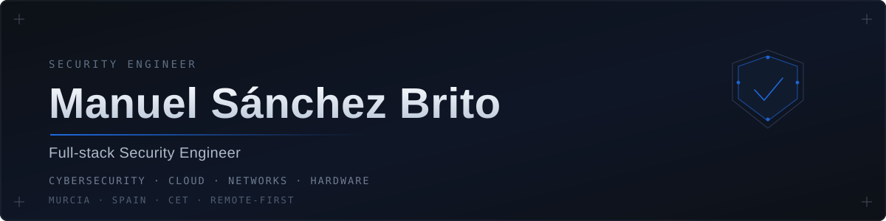

<!-- Banner: assets/banner.svg — single theme-invariant SVG committed under assets/. -->

  

`I build and ship security products end to end — from hardware and networks to the cloud that runs them.`

**Full-stack Security Engineer** · Founder [@no-do.dev](https://no-do.dev) · Murcia, Spain (CET) · Remote-first

  
  
  
  

## About

I'm a full-stack security engineer who builds security products end to end — from hardware and networks to the cloud that runs them.

I designed, shipped and now **operate two products in production**: **GRIMZ**, a self-hosted penetration-testing platform with live billing and a deny-by-default scope engine, and **TRACEZ**, an OSINT intelligence SaaS on the Cloudflare edge with tamper-evident, Ed25519-signed evidence. Alongside them I architect **DEEPWIRE**, a recon platform with private, controlled egress.

Day to day I move across the whole stack: Python scanning engines, strict-TypeScript Cloudflare Workers, Docker-based monitoring (Prometheus / Grafana), DNS filtering, mesh networking, honeypots, and live incident response — including real malware analysis and OSINT attribution after an intrusion.

An electronics technician by training and self-taught in security, with roots in hardware (multilayer PCB / RF) and six years mentored inside real network infrastructure. I care about **zero-trust defaults, verifiable evidence, and fixing the root cause with the smallest possible change.**

## What I build

| Project | What it is | Stack |
|---|---|---|
| **GRIMZ** — Commercial pentesting platform *(Founder & Lead Engineer)* | Self-hosted pentest product, shipped end to end: license issuer, store, gated downloads and live Stripe billing. Deny-by-default scope engine + kill-switch, PTY-backed terminal, per-target rate limiting, isolated Metasploit lab. | Python · Flask · Stripe |
| **TRACEZ** — OSINT intelligence SaaS *(Founder & Lead Engineer)* | Production OSINT & graph-intelligence on the Cloudflare edge (Workers, D1, R2, KV, WAF): Google SSO, 2FA, entity merge, Stripe billing. Tamper-evident Ed25519-signed evidence + public verification, AI-assisted entity expansion with human-in-the-loop. | TypeScript · Cloudflare Workers · D1 · R2 |
| **DEEPWIRE** — Recon & attack-surface platform *(Architect)* | Standalone recon engine; security-audited (scope-bypass, CSRF, session revocation, rate-limit); private egress via a Tailscale exit-node so scans never expose home infrastructure. | Recon engine · Cloudflare Worker · Tailscale · AWS |
| **Security Operations & DFIR** *(Operator)* | End-to-end incident response on a real infostealer (malware analysis, C2 attribution, credential rotation). Operates a Docker monitoring stack (Prometheus, Grafana, Uptime Kuma) with DNS filtering and a T-Pot honeypot. | Ghidra · Tshark · T-Pot · Docker |

## Selected public work

- **[minimeters-bridge](https://github.com/Manuel-1312/minimeters-bridge)** — Real-time audio metering engine (LUFS R128, FFT spectrum, true peak, correlation) streamed over WebSocket from WASAPI loopback. `TypeScript` · `Python`
- **[realmeters-spotify](https://github.com/Manuel-1312/realmeters-spotify)** — Mastering-style real-audio visualizer for Spotify (Spicetify custom app): LUFS, spectrum, spectrogram, true peak, stereometer. Published on the Spicetify Marketplace. `TypeScript`
- **[personal-dictionary-of-ethical-hacking](https://github.com/Manuel-1312/personal-dictionary-of-ethical-hacking)** — A working reference of ethical-hacking concepts and tooling, with a script launcher and CI. `Python`

## Skills

**Offensive & DFIR** — Ghidra · Metasploit · Nmap · Masscan · Tshark · T-Pot · malware analysis · incident response · honeypots · OSINT attribution · network traffic analysis · beaconing detection

**Cloud & Edge** — Cloudflare (Workers, Pages, D1, R2, KV, WAF) · Docker · Stripe · AWS Lightsail · Tailscale mesh · DNS · segmentation · controlled egress

**Languages & Crypto** — Python (Flask) · TypeScript (Zod) · Go · C#/.NET (Blazor, EF Core) · Rust (PyO3) · applied cryptography (AES-GCM, HKDF, Ed25519)

**Monitoring** — Prometheus · Grafana · Blackbox · Uptime Kuma · DNS filtering

**Hardware & Firmware** — KiCad · Flux.ai (multilayer PCB for RF) · reverse-engineering · chip programming · board-level repair · ESP32 / ESP-IDF · MT7612U

## Background

- **National Medical Library of Cuba — Infrastructure** · Havana · 2018–2024 — Six years learning network infrastructure under the library's systems administrator: firewalls, public/web services and network administration across Infomed, Cuba's national health network.
- **Electronics & Hardware Workshop** · Havana · 2016–2018 — Hands-on apprenticeship beside senior technicians: board-level repair, chip programming & hardware reverse-engineering — the origin of my firmware work.

**Education** — IT Professional Training, Universidad de las Ciencias Informáticas (UCI), Havana (2021–2023) · Técnico Medio en Electrónica, Havana (2016–2019)
**Languages** — Spanish (native) · French (upper-intermediate) · English (intermediate)

## Contact

**Open to remote or hybrid roles** in Detection & Response, Cloud Security, Security Engineering and DevSecOps.

- 💼 **LinkedIn** — [manuel-sanchez-brito](https://www.linkedin.com/in/manuel-sanchez-brito/)
- ✉️ **Email** — [nodo.automatizacion@gmail.com](mailto:nodo.automatizacion@gmail.com)
- 🌐 **Web** — [no-do.dev](https://no-do.dev)

Full-stack security engineer · Murcia, Spain · CET · Remote-first
